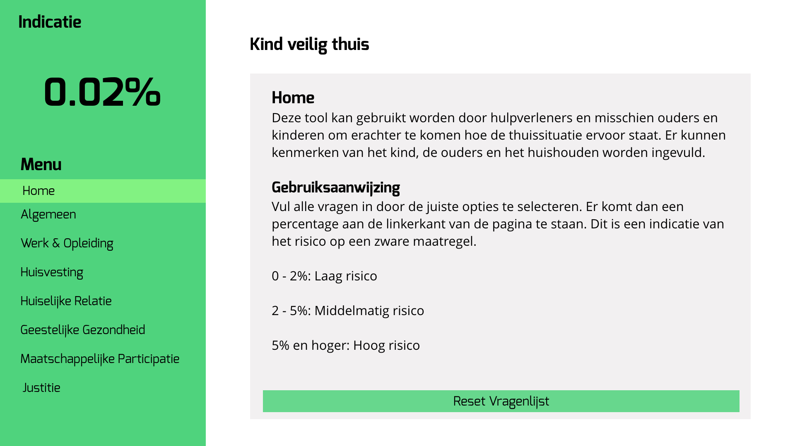
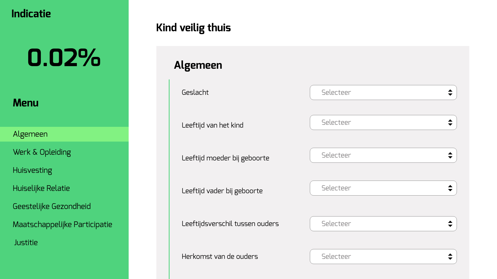

<!-- # Polymer App Toolbox - Starter Kit

[](https://travis-ci.org/Polymer/polymer-starter-kit)

This template is a starting point for building apps using a drawer-based
layout. The layout is provided by `app-layout` elements.

This template, along with the `polymer-cli` toolchain, also demonstrates use
of the "PRPL pattern" This pattern allows fast first delivery and interaction with
the content at the initial route requested by the user, along with fast subsequent
navigation by pre-caching the remaining components required by the app and
progressively loading them on-demand as the user navigates through the app.

The PRPL pattern, in a nutshell:

* **Push** components required for the initial route
* **Render** initial route ASAP
* **Pre-cache** components for remaining routes
* **Lazy-load** and progressively upgrade next routes on-demand

### Setup

##### Prerequisites

Install [Polymer CLI](https://github.com/Polymer/polymer-cli) using
[npm](https://www.npmjs.com) (we assume you have pre-installed [node.js](https://nodejs.org)).

    npm install -g polymer-cli@next

##### Initialize project from template

    mkdir my-app
    cd my-app
    polymer init polymer-3-starter-kit

### Start the development server

This command serves the app at `http://127.0.0.1:8081` and provides basic URL
routing for the app:

    npm start

### Build

The `npm run build` command builds your Polymer application for production, using build configuration options provided by the command line or in your project's `polymer.json` file.

You can configure your `polymer.json` file to create multiple builds. This is necessary if you will be serving different builds optimized for different browsers. You can define your own named builds, or use presets. See the documentation on [building your project for production](https://www.polymer-project.org/3.0/toolbox/build-for-production) for more information.

The Polymer Starter Kit is configured to create three builds. These builds will be output to a subdirectory under the `build/` directory as follows:

```
build/
  es5-bundled/
  es6-bundled/
  esm-bundled/
```

* `es5-bundled` is a bundled, minified build with a service worker. ES6 code is compiled to ES5 for compatibility with older browsers.
* `es6-bundled` is a bundled, minified build with a service worker. ES6 code is served as-is. This build is for browsers that can handle ES6 code - see [building your project for production](https://www.polymer-project.org/3.0/toolbox/build-for-production#compiling) for a list.
* `esm-bundled` is a bundled, minified build with a service worker. It uses standard ES module import/export statements for browsers that support them.

Run `polymer help build` for the full list of available options and optimizations. Also, see the documentation on the [polymer.json specification](https://www.polymer-project.org/3.0/docs/tools/polymer-json) and [building your Polymer application for production](https://www.polymer-project.org/3.0/toolbox/build-for-production).

### Preview the build

This command serves your app. Replace `build-folder-name` with the folder name of the build you want to serve.

    npm start build/build-folder-name/

### Run tests

This command will run [Web Component Tester](https://github.com/Polymer/web-component-tester)
against the browsers currently installed on your machine:

    npm test

If running Windows you will need to set the following environment variables:

- LAUNCHPAD_BROWSERS
- LAUNCHPAD_CHROME

Read More here [daffl/launchpad](https://github.com/daffl/launchpad#environment-variables-impacting-local-browsers-detection)

---

Looking for our older PSK2 Polycast or migration blog post? See [the previous README](https://github.com/Polymer/polymer-starter-kit/blob/v3.2.1/README.md). -->

# README.md

- [Install](#install-the-risico-app)
- [Concept](#concept)
- [Process](#process)
- [My opinion](#my-opinion)
- [Links I used](#links-i-used)
- [License](#license)

## Install the risico-app
To install the risico you have to follow a few steps:

You need to change directory in your terminal first to the folder where you want to install everything. Use cd in your terminal to get to the place where you want to install on you computer.  
Example: cd folder_name

To clone the repository:

```js
git clone https://github.com/LindadeHaan/risico-app  
cd risico-app  
npm install
```

Start server:
```js
npm start
```
##### package.json
To make a package.json file you have to follow this step in you terminal:

```js
npm init
```
After npm init you just have to fill in what your terminal requires. In your package.json file you can see which packages you already installed and which packages you still have to install. You can install these packages with:
```js
npm install _package-name_ --save
```

## Concept
My idea was to make all these questions less overwhelming, because there are so many of them. I did not necessarily change the questions or the order of the questions. I wanted to make ik more peaceful with the styling of the page.
I wanted to make it accessible to the parents en children and maybe make it possible for the parents en children to fill in the questions.

I wanted to give it a simplistic feel and I did not want to add to much to the page. The less there is on the page the less distractions.

You see the impact of the choices on the percentage immediately. You don't have to fill in all the questions and then click a button to see the results. You can see the results immediately.
Maybe you don't have to fill in all the questions to see if a child needs to get out from home sites (uit huis plaatsen).


I used the color green because I think it is a friendly color. It is not overwhelming because I did not use a vibrant green, but a very mellow green.


I made the layout simple by giving the dropdowns a lot of space around it.


## Process

### Week 1

#### *Monday october 8*
The first day of the project the client came to do a presentation about the organisation.
We also get to know a little about the assignment we were about to get.

In the afternoon we went to see the neighbourhood with all of the students and get to know eachother a little more.

#### *Tuesday october 9*
Today there were three speakers who were telling about the three biggest frameworks: `React`, `Vue.js` and `Angular.js`.

After the speakers were done explaining and promoting the frameworks we had to do some research about these and other frameworks.

We had a bootcamp from one of our teachers about the stuff we learned until now. It was a refreshment!

At the end of the day we had to give the teacher a top three of frameworks would like to use.
1. Vue.js;
2. React.js;
3. Polymer.js

#### *Wednesday october 10*
Today we get to hear the framework we have to work with for two weeks.

I've got the framework `Polymer`.
For the rest of the day I was researching the framework even more and following tutorials to understand the framework.

The client came by again to show more information and data we can use to make the assignment we got.

We also had a JavaScript bootcamp from one of the teachers.

##### `Polymer`
Polymer is an open-source JavaScript library for building web applications using Web Components. The library is being developed by Google developers and contributors on GitHub. Modern design principles are implemented as a separate project using Google's Material Design design principles.

Polymer is used by a number of Google services and websites, including the redesigned YouTube, YouTube Gaming, the redesigned Google Earth, Google I/O websites, Google Play Music, redesign of Google Sites and Allo for web.

Other notable users include Netflix, Electronics Arts, ING, Coca-Cola, McDonald's, BBVA, IBM and General Electric.  
(Source: https://en.wikipedia.org/wiki/Polymer_(library))

#### *Thursday october 11*
I was still researching the framework I got. It was hard to find a good documentation because not many people use the framework `Polymer`.
Eventually we found a starter-kit.

I worked together with other people who had to work with the framework `Polymer`. We really helped each other.

##### *Friday october 12*
Beginning to understand the framework a little bit more everytime. We found a tutorial to follow to understand the `selected` element in `Polymer`.

I have watched a lot of tutorials on youtube and followed a couple of them.

### Week 2

#### *Monday october 15*
Today the client came with one emergency worker (hulpverlener) who could be using the product we were making and there were two emergency workers (hulpverleners) that already use the existing app, but that does not function properly.

It was very useful to hear what emergency workers want in tool they use at work.

I followed a tutorial again. I do this to understand how the framework works.

#### *Tuesday october 16*
Made several pages and links to them. Added all the forms.

Still not understanding the framework entirely, but I'm getting there.

#### *Wednesday october 17*
There was a speaker today (Nienke Dekker). She talked about why to use a framework.

A framework is declarative: only describes the logic of your application. You don't have to tell how to do it, that is what the framework does for you.

*Most important reasons to use a framework:*
- Keep the UI en states insync;
- You only have to worrry about the looks of the UI.

Added localStorage to the app. Chelsea Doeleman and Maikel van Veen helped me a lot with this code. I could not figure it out myself. With the help of Chelsea and Maikel I understand the code and how you save the code in you localStorage.

Added a lot of styling and made components of the forms.

#### *Thursday october 18*
Added the formula to get the percentage of the risk.
With the help of Chelsea (and Maikel) I added the formula to the risico-app. Now the website calculates the risk while you select a value in a dropdown.

#### *Friday october 19*
The presentations.
Before I had my presentation I still worked a lot on my app. I wasn't satisfied with the styling. I did not know what color to use. Eventually I went with green because I think this is a friendly color.
I prepared my pitch and practiced it.

## My opinion
At fist I was excited to be working with frameworks, because I've never done that before and of course I wanted to learn this. What the speakers, who told about three frameworks, said was very interesting to me. I was motivated to get to work and to do some research on frameworks.

After we got assigned our framework we had to work with for two weeks I was still motivated to get to work. But after doing some deeper research and talking about it with the other students who had to work with Polymer, I soon found out that it was going to be hard.
We were all thinking about switching frameworks, but then we would have less time to make something.

Fist I wanted to understand what a `component` was, because I did not know this before I started working with this framework. Polymer is all about components.  
Now I knwo what they are, I know they are very useful! You write code once, make it a component and then you can use it in multiple files without writing all the same code again.

Something I did not do enough research for was: searching for a good documentation. Polymer does not have a great documentation on the site. It does have good tutorial though, but that was not enough to fully understand everything.
That is why I was very happy that Maikel and Chelsea had the same framework. Especially Maikel figured out so much code. He explained much of it to Chelsea and she explained it to me. Otherwise I would've never got all the write code so everything would work.

Would I recommend Polymer? I don't know. Because it is the only framework I worked with so far, so I don't have any experience with frameworks.
But from what I heard from Maikel is that other frameworks are better to work with and probably easier to learn because of better documentation.

## Links I used
- https://www.polymer-project.org/3.0/start/
- https://www.polymer-project.org/3.0/start/first-element/intro
- https://github.com/Polymer/polymer-starter-kit
- https://www.polymer-project.org/3.0/start/toolbox/add-elements

#### Videos
- https://www.youtube.com/watch?v=MaWcS-10NIw&list=PLLnpHn493BHHbOWwQxtGCVfEgWZxxofyA
- https://www.youtube.com/watch?v=NqwSh31SHrA&list=PLvVKmViR0Z7bZj2XH_u-EolXGVoc1VwcT
- https://www.youtube.com/watch?v=7CUO7PyD5zA

## License
MIT
